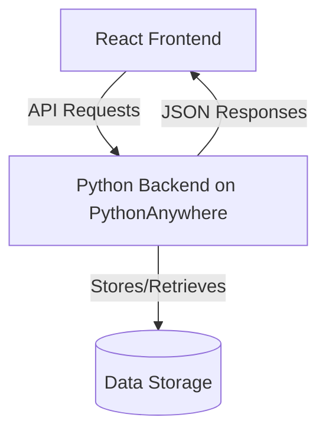
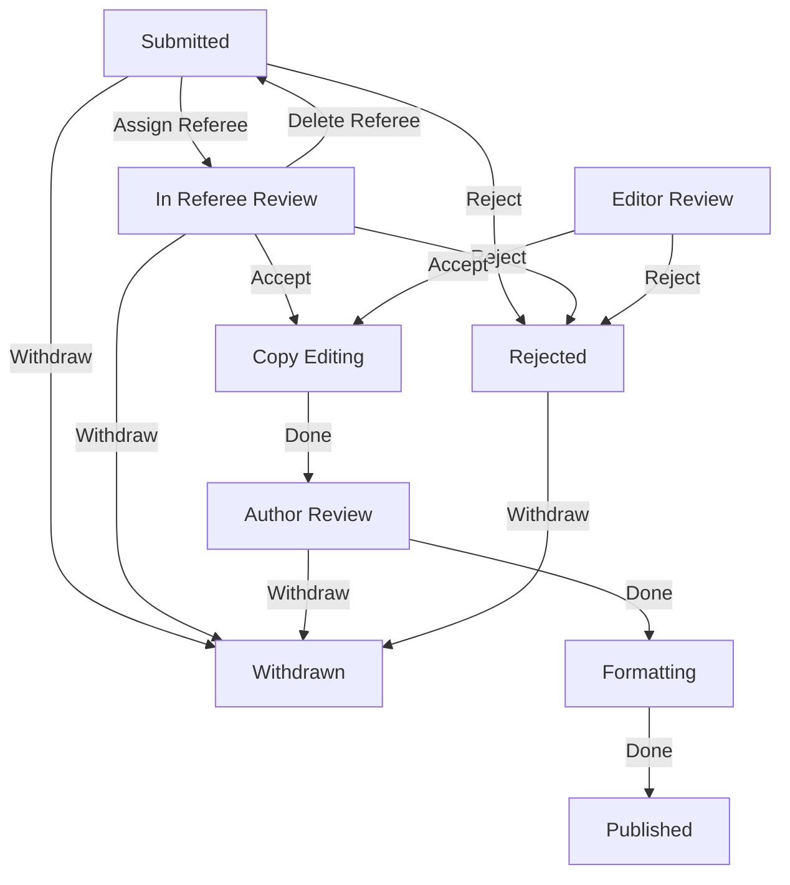

# Backend Design Document

## Overview
The backend of the People Management System is a Python-based API hosted on PythonAnywhere. It provides RESTful endpoints for managing personnel information and organizational structure.

## Architecture

### System Overview


### Hosting
- **Platform**: PythonAnywhere
- **URL**: https://zcd.pythonanywhere.com

### API Endpoints

#### People Management
- `GET /people`: Retrieve all people
- `POST /people/create`: Create a new person
- `PUT /people/update/{email}`: Update an existing person
- `DELETE /people/{email}`: Delete a person

#### Manuscript Management
- `GET /manuscripts/`: Retrieve all manuscripts
- `GET /manuscripts/<author>`: Retrieve manuscripts by author
- `PUT /manuscripts/create`: Create a new manuscript
- `DELETE /manuscripts/delete/<id>`: Delete a manuscript
- `PUT /manuscripts/receive_action`: Perform actions on manuscripts (state transitions)
- `GET /manuscripts/state_transitions`: Get valid state transitions
- `GET /manuscripts/state_names`: Get human-readable state names
- `GET /manuscripts/valid_states`: Get valid manuscript states
- `GET /manuscripts/sorted`: Get manuscripts sorted by workflow state
- `GET /manuscripts/by_state/<state>`: Get manuscripts filtered by state

#### Masthead
- Endpoints for retrieving role-based organizational data

## Security Architecture

### Authentication System

#### Login Flow
1. User submits credentials (email and password) to `/people/login` endpoint
2. Backend validates credentials using password hashing
3. On successful authentication, user details including roles are returned
4. Frontend stores user data in localStorage and manages session state
5. Authentication state is managed through React Context API

#### Password Security
- Passwords are hashed using Werkzeug's `generate_password_hash` function
- Password verification uses `check_password_hash` for secure comparison
- Plain text passwords are never stored in the database

### Authorization Framework

#### Role-Based Access Control
- Users are assigned one or more roles (e.g., Editor, Referee)
- Role validation ensures only valid roles can be assigned
- Frontend components conditionally render based on user roles
- Backend endpoints can verify role requirements
- Special roles include:
  - `ED`: Editor - Can manage manuscripts and perform editorial actions
  - `ME`: Managing Editor - Has elevated privileges for manuscript workflow
  - `RF`: Referee - Can review assigned manuscripts
  - `AU`: Author - Can submit and manage their own manuscripts

#### Permission Model
- Feature-based permission system with CRUD granularity
- Permissions are stored in the database and loaded at runtime
- Default-deny policy for undefined permissions
- Support for user-specific permissions via user lists
- Permission structure follows this format:
  ```json
  {
    "feature_name": {
      "create": {
        "user_list": ["user1@example.com", "user2@example.com"],
        "checks": {
          "login": true,
          "ip_address": false,
          "dual_factor": false
        }
      },
      "read": { ... },
      "update": { ... },
      "delete": { ... }
    }
  }
  ```

#### Manuscript-Specific Access Control
- Manuscript state transitions are strictly controlled by workflow rules
- Only authorized roles can perform specific actions on manuscripts
- Referees can only access manuscripts assigned to them
- Authors can only access their own manuscripts
- Editors have broader access to manage the publication workflow

#### Security Logging
- Dedicated security logger with rotation (5MB files, 2 backups) has been implemented
- Framework for logging permission checks with timestamp, feature, action, user, and result
- Logs stored in `security.log` for audit purposes
- Currently in development phase with plans to integrate throughout the application
- API endpoint `/security/logs` available for viewing recent log entries

### API Security

#### CORS Configuration
- Access-Control-Allow-Origin: *
- Content-Type and Accept headers: application/json
- withCredentials: false

#### Input Validation
- Email format validation using regex pattern matching
- Role validation against predefined valid roles
- Required field validation for critical operations
- Error responses with appropriate HTTP status codes

### Data Protection

#### Sensitive Data Handling
- User passwords are never stored in plaintext
- Password hashing using Werkzeug's secure hashing functions
- Manuscript review data is protected based on role permissions
- API responses are structured to avoid leaking sensitive information

#### Database Security
- MongoDB database with proper access controls
- Connections managed through a centralized database connector
- Data validation before storage to prevent injection attacks
- Database operations encapsulated in dedicated modules

### Security Vulnerabilities and Mitigations

#### Cross-Site Request Forgery (CSRF)
- CORS configuration limits cross-origin requests
- API endpoints validate request origin
- Authentication required for sensitive operations

#### Injection Attacks
- Input validation for all user-provided data
- Parameterized database queries
- Content-Type enforcement for API requests

#### Authentication Vulnerabilities
- Password complexity requirements (not currently enforced, future enhancement)
- Rate limiting for login attempts (not currently implemented, future enhancement)
- Session management through frontend localStorage (with known limitations)

### Future Security Enhancements

#### Short-term Improvements
- Implement rate limiting for authentication endpoints
- Add password complexity requirements
- Enhance error messages to avoid information leakage
- Implement proper CSRF protection

#### Long-term Roadmap
- Move from localStorage to secure HTTP-only cookies
- Implement JWT-based authentication with refresh tokens
- Add two-factor authentication for sensitive operations
- Implement IP-based access controls for administrative functions
- Regular security audits and penetration testing

## Data Models

### Person Model
- Email (unique identifier)
- Name
- Role
- Additional attributes as needed

### Manuscript Model
- Manuscript ID (unique identifier generated using mnemonic words)
- Title
- Author (email)
- Referees (list of referee emails)
- Current State (workflow state code)

## Manuscript Workflow

### States
- `SUB`: Submitted - Initial state when manuscript is created
- `REV`: In Referee Review - When manuscript is assigned to referees
- `EDR`: Editor Review - When manuscript is being reviewed by editors
- `CED`: Copy Editing - When manuscript is accepted and being copy edited
- `AUR`: Author Review - When manuscript is returned to author for review
- `FMT`: Formatting - When manuscript is being formatted for publication
- `PUB`: Published - Final state for accepted manuscripts
- `REJ`: Rejected - Final state for rejected manuscripts
- `WIT`: Withdrawn - Final state for withdrawn manuscripts

### Actions
- `ARF`: Assign Referee - Assign a referee to review the manuscript
- `DRF`: Delete Referee - Remove a referee from the manuscript
- `ACC`: Accept - Accept the manuscript for publication
- `REJ`: Reject - Reject the manuscript
- `DON`: Done - Mark current stage as complete
- `WIT`: Withdraw - Withdraw the manuscript from consideration
- `EMV`: Editor Move - Special action allowing editors to move manuscript to any state

## Implementation Details

### API Standardization
- All endpoints follow consistent pattern: `/people/[action]/[params]`
- Removed `/api` prefix from all endpoints
- REST conventions: POST for creation, PUT for updates
- HATEOAS implementation remains available but currently not in use

### Data Flow

#### CRUD Operations
1. Frontend makes API call to backend endpoint
2. Backend processes request and performs database operation
3. Backend returns response with updated data or confirmation

#### Manuscript Workflow
1. Frontend requests manuscript data or initiates a state transition
2. Backend validates the requested action against the current state
3. Backend performs the action and updates the manuscript state
4. Backend returns the updated state and manuscript data

#### Manuscript State Transitions


#### Masthead Data Flow
1. Frontend requests masthead data from backend
2. Backend retrieves personnel data and organizes by roles
3. Backend returns structured data for frontend rendering

### Error Handling
- Backend returns meaningful error responses with appropriate HTTP status codes
- Consistent error format across all endpoints

## Testing
- Unit tests for data models and business logic
- Integration tests for API endpoints
- Test coverage for all major functionality

## Future Plans
- Add advanced filtering and search capabilities
- Implement better user authentication and role-based access control
- Add reporting and analytics features
- Enhance data validation and error handling
- Enhanced logic for better flexibility and scalability
